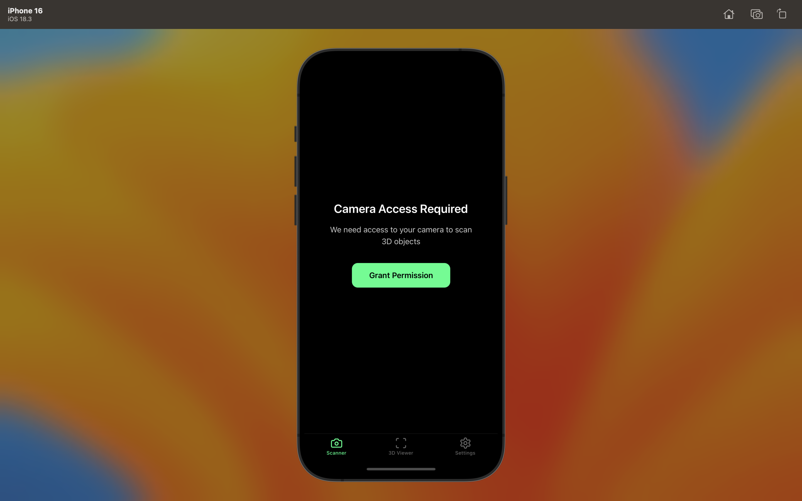
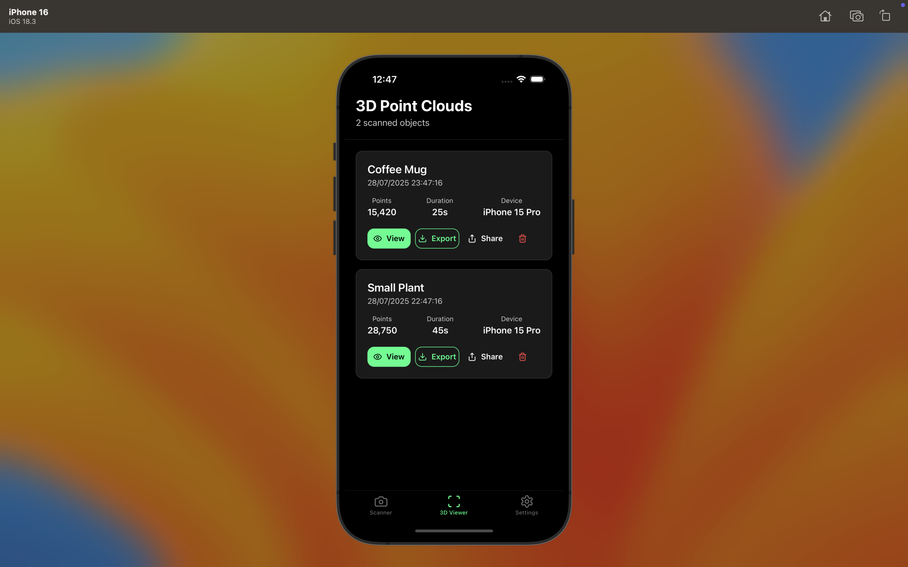
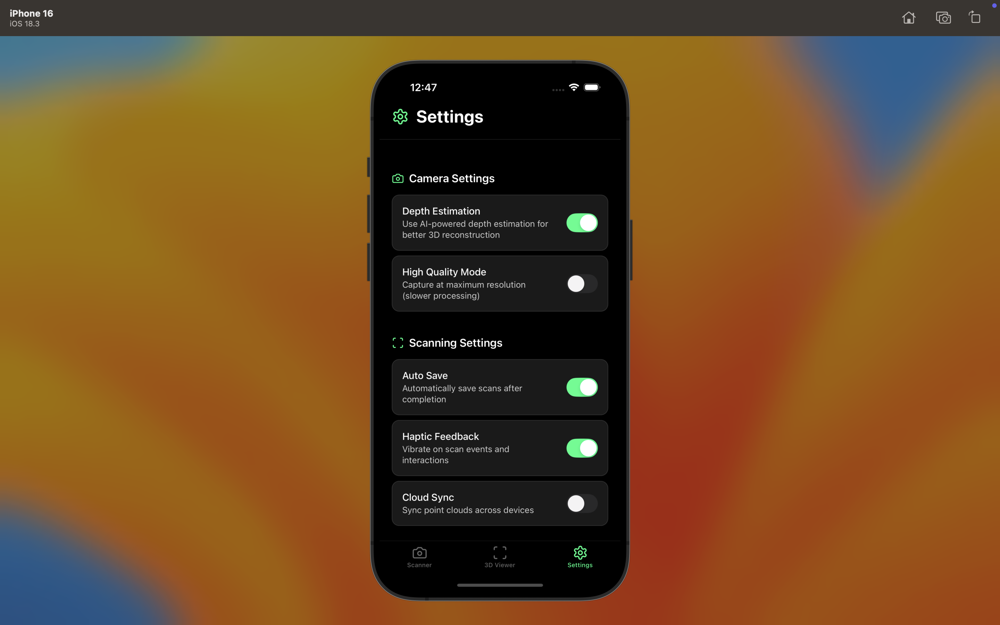

# 3D Scanner Foundation App

A professional-grade 3D scanning application built with React Native, Expo, and TypeScript. This foundation app provides a complete architecture for camera-based 3D reconstruction with photogrammetry techniques, designed to be easily extended with native LiDAR capabilities.

## 🚀 Features

### Core Functionality

- **Real-time Camera Scanning**: Professional camera interface with live preview
- **3D Point Cloud Visualization**: Interactive viewer for generated 3D models
- **Multi-format Export**: Support for PLY format with extensible architecture
- **Comprehensive Settings**: Full app configuration with user preferences
- **Data Management**: Local storage with share and export capabilities

### User Experience

- **Smooth Animations**: 60fps animations using React Native Reanimated
- **Haptic Feedback**: Tactile responses for enhanced user interaction
- **Progress Tracking**: Real-time scanning progress with visual indicators
- **Error Handling**: Comprehensive error states with user-friendly messages

## 📱 Screenshots





## 🏗️ Architecture

### Design Patterns

- **Custom Hooks**: Encapsulated business logic with reusable state management
- **Component Composition**: Modular, reusable UI components
- **Type Safety**: Complete TypeScript coverage for better development experience
- **Clean Architecture**: Separation of concerns with clear data flow

## 🎯 Usage

### Basic Scanning

1. **Launch App**: Open the scanner tab
2. **Grant Permissions**: Allow camera access when prompted
3. **Position Subject**: Frame your object in the camera view
4. **Start Scanning**: Tap the scan button to begin capture
5. **Multi-angle Capture**: Move around the object for comprehensive coverage
6. **Process**: Wait for automatic point cloud generation

### 3D Viewing

1. **Navigate to Viewer**: Switch to the viewer tab
2. **Select Scan**: Choose from your saved scans
3. **Interact**: Rotate and zoom the 3D model
4. **Export**: Share or export in various formats

### Configuration

1. **Open Settings**: Access the settings tab
2. **Adjust Quality**: Set scanning resolution and quality
3. **Configure Storage**: Manage local data and exports
4. **Enable Features**: Toggle advanced scanning options

## 🔧 Configuration

### Camera Settings

```typescript
export const CAMERA_CONFIG = {
  quality: 'high' as const,
  format: 'jpeg' as const,
  maxImages: 50,
  captureInterval: 500 // ms
};
```

### Scanning Parameters

```typescript
export const SCANNING_CONFIG = {
  minImages: 10,
  maxProcessingTime: 30000, // ms
  pointDensity: 'medium' as const,
  filterNoise: true
};
```

## 🚀 Performance Optimizations

### React Native Best Practices

- **FlatList Optimization**: Efficient rendering of large point cloud data
- **Image Caching**: Smart caching strategy for captured images
- **Memory Management**: Proper cleanup of camera resources
- **Bundle Splitting**: Code splitting for faster app startup

### Animation Performance

- **Native Driver**: All animations run on the native thread
- **Reanimated 3**: Latest version for optimal performance
- **Gesture Handling**: Smooth, responsive touch interactions

## 🔮 Future Enhancements

### LiDAR Integration (Planned)

The app is architected to support native LiDAR integration:

```typescript
// Future LiDAR interface
interface LiDARCapabilities {
  hasLiDAR: boolean;
  maxRange: number;
  resolution: LiDARResolution;
  realTimeProcessing: boolean;
}
```

### Planned Features

- **Real-time LiDAR Scanning**: Native iOS/Android LiDAR support
- **Cloud Processing**: Server-side 3D reconstruction
- **AR Visualization**: Augmented reality overlay
- **Advanced Formats**: Support for OBJ, STL, GLTF exports
- **Collaborative Scanning**: Multi-device scanning sessions

## 🧪 Development Build Integration

For native LiDAR capabilities, you'll need to:

1. **Export Project**: `npx expo eject` or create development build
2. **Create Native Modules**: Platform-specific LiDAR access
3. **Rust Integration**: Use `uniffi-rs` for cross-platform libraries
4. **Bridge Setup**: JavaScript bindings for native code

## 📝 Contributing

### Development Workflow

1. Fork the repository
2. Create a feature branch
3. Make your changes with proper TypeScript types
4. Add tests for new functionality
5. Submit a pull request

### Troubleshooting

- **Camera Permission Issues**: Check device settings and app permissions
- **Performance Problems**: Reduce scanning quality in settings
- **Export Failures**: Ensure sufficient storage space

## 🙏 Acknowledgments

- **Expo Team**: For the excellent React Native framework
- **React Native Community**: For reanimated and gesture handler
- **3D Graphics Community**: For photogrammetry research and techniques

---

**Built with ❤️ using React Native, Expo, and TypeScript**
